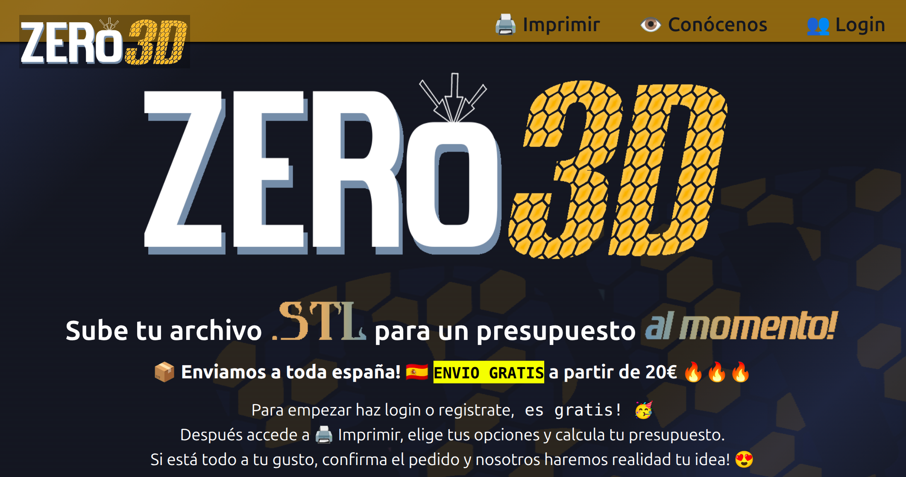
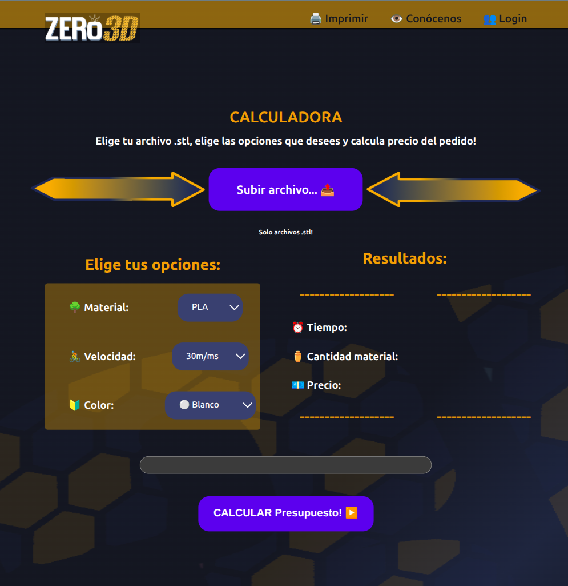

# Suite‑Zero3D Stage


> **Este README está realizado para el entorno *stage*.**
> A diferencia de la verisión para *develop*, aquí **se empieza a usar NGINX** para levantar la red interna y el proxy inverse.
> Las imágenes pre-compiladas sustituyen al levantamiento por código, utilizamos dichas imagenes como producto inal para levantar en el servidor, se utilizan los repositorio para hacer debug con los entornos.
---

## 📑 Índice

* [✨ Descripción breve](#-descripción-breve)
* [🖼️ Capturas](#️-capturas)
* [🚀 Comenzar](#-comenzar)
* [🐳 Ejecutar con Docker Compose](#-ejecutar-con-docker-compose)
* [📂 Estructura del proyecto](#estructura-del-proyecto)
* [⚙️ Variables de entorno](#️-variables-del-entorno)
* [🔌 API Reference](#-api-reference)
* [🧪 Tests](#-tests)
* [📄 Licencia](#-licencia)

---

## ✨ Descripción breve

**Stage** es el entorno de pruebas de *Suite‑Zero3D*. Utilizamos las imágenes ya publicadas en **Docker Hub** para que el despliegue sea rapido e inmediato y lo más parecido al servidor de producción, pero sin los riesgos que convella.

---

## 🖼️ Capturas

Coloca aquí algunas capturas de tu despliegue staged:

Ejemplos de la web:




---

## 🚀 Comenzar

### 0. Prerequisitos
```bash
$ sudo apt remove docker docker-engine docker.io containerd runc   # → Eliminar versiones antiguas.
$ sudo apt update
$ sudo apt upgrade -y 
$ sudo apt install -y ca-certificates curl gnupg lsb-release

$ sudo mkdir -p /etc/apt/keyrings                                  # → Agrega clave GPG oficial de Docker.
$ curl -fsSL https://download.docker.com/linux/ubuntu/gpg | sudo gpg --dearmor -o /etc/apt/keyrings/docker.gpg

$ echo "deb [arch=$(dpkg --print-architecture) signed-by=/etc/apt/keyrings/docker.gpg] https://download.docker.com/linux/ubuntu $(lsb_release -cs) stable" | sudo tee /etc/apt/sources.list.d/docker.list > /dev/null          # → Agrega repositorio oficial.

$ sudo apt update
$ sudo apt upgrade -y 
$ sudo apt install -y docker-ce docker-ce-cli containerd.io docker-buildx-plugin docker-compose-plugin
```

### 1. Clonar el repositorio (rama `stage`)

```bash
$ git clone --branch develop --recurse-submodules https://github.com/JulianCabanillas/Suite-Zero3D.git
$ cd Suite-Zero3D
```

### 2. Crear archivo `.env.staging`

```bash
$ cp Client-Back-Zero3D/.env.example Client-Back-Zero3D/.env.staging
```

### 3. Descargar las imágenes

```bash
$ docker compose -f docker-compose-stage.yml pull   # opcional, ‘up’
```

### 4. Levantar el stack

```bash
$ docker compose -f docker-compose-stage.yml up -d   # sin --build ✔
```

### 5. Entrar

| Servicio    | URL                                            |
| ----------- | ---------------------------------------------- |
| Front + API | [http://localhost:8080](http://localhost:8080) |
| PGAdmin     | [http://localhost:5051](http://localhost:5051) |
| Portainer   | [http://localhost:9001](http://localhost:9001) |

> En stage no hay **hot‑reload** ni puerto 3000; todo pasa por Nginx para simular el estado de producción.
Cuando se levanta por primera vez Portainer hay que crear rapidamente usuario, tiene tiempo determinado.

> **Tip:** Servicios:
 - Puerto 8080 (Nginx) -> http://stage.zero3d.shop:8080
 - Puerto 3000 (frontend dev) 
 - Puerto 8000 (backend)
 - Puerto 5051 (PGAdmin) -> http://stage.zero3d.shop:5051
 - Puerto 9001 (Portainer). -> http://stage.zero3d.shop:9001

---

## 🐳 Ejecutar con Docker Compose

Comandos típicos:

```bash
# Ver estado
$ docker compose -f docker-compose-stage.yml ps

# Logs (seguimiento de Nginx, por ejemplo)
$ docker compose -f docker-compose-stage.yml logs -f nginx

# Actualizar a las últimas imágenes publicadas
$ docker compose -f docker-compose-stage.yml pull
$ docker compose -f docker-compose-stage.yml up -d  # recrea los servicios si hay cambios

# Parar y limpiar contenedores sin borrar la BD
$ docker compose -f docker-compose-stage.yml down

# Parar y BORRAR BD, volumenes e imagenes
$ docker compose -f docker-compose-stage.yml down --volumes --rmi all --remove-orphans
```
La orden --volumes elimina los volumenes generados, la orden --remove-orphans para los huerfanos y --rmi all para las imagenes.
---

## 📂 Estructura del proyecto

```
Suite‑Zero3D/
├─ docker-compose-stage.yml        # Este archivo orquesta el entorno
├─ Client-Front-Zero3D/            # Preact (compilado ⇢ /dist en la imagen)
├─ Client-Back-Zero3D/             # Django + DRF (código fuente — opcional hack)
└─ Nginx/                          # Configuración del proxy
```

---

## ⚙️ Variables del entorno

El contenedor **backend** consume las variables definidas en
`Client-Back-Zero3D/.env.staging` (referido por `env_file:` en Compose):

```dotenv
SECRET_KEY='django-insecure-gc9w9#$!#3p$46*#0kfghec86c0w-08l8ez1$cw-sjp81=br#'
DATABASE_NAME=zero3d_stage_db
DATABASE_USER=admin
DATABASE_PASSWORD=admin
DATABASE_HOST=db
DATABASE_PORT=5432
ALLOWED_HOSTS=stage.zero3d.shop,www.stage.zero3d.shop,localhost
SLIC3R_PATH=/usr/bin/slic3r
MAILTRAP_USER=xxxxx
MAILTRAP_PASS=yyyyy
DJANGO_SETTINGS_MODULE=appBackClient.settings.staging
```

---

## 🔌 API Reference

**Base URL**: `http://localhost:8080/api/`

| Método | Endpoint            | Descripción                      |
| ------ | ------------------- | -------------------------------- |
| POST   | `/login_client/`    | Autenticación y obtención de JWT |
| POST   | `/register_client/` | Alta de cliente + login          |
| POST   | `/register_order/`  | Crea pedido vinculado al usuario |
| POST   | `/calculator/`      | Calcula precio de impresión 3D   |

---

## 🧪 Tests

Los tests se ejecutan **dentro** del contenedor backend:

```bash
$ docker compose -f docker-compose-stage.yml exec backend pytest -q
```

---

## 📄 Licencia

Distribuido bajo **GNU GPL v3** — consulta `LICENSE` para los detalles.
